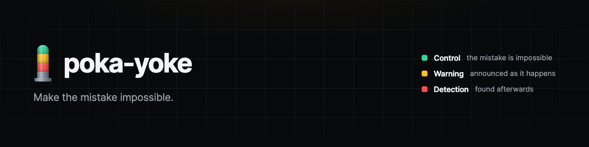
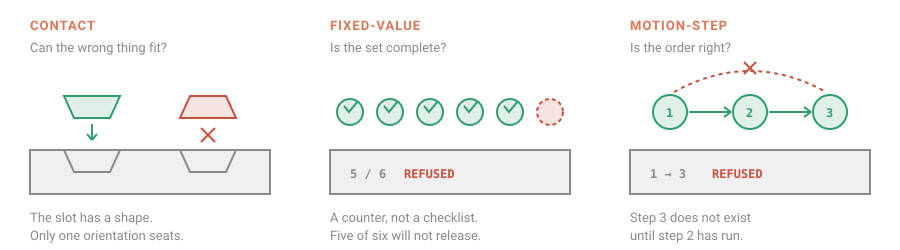

<p align="center">
  
</p>

# Poka-Yoke

> **Every feature you ship adds new ways to get it wrong. Poka-Yoke removes them as you build.**
>
> The mistake-proofing pass between your plan and your pull request, 11 skills, ~30 catalogued
> hazards, a dependency-free scanner for TypeScript, Python, Go, Rust and SQL, and installable
> pre-commit / CI / lint / hook devices. [Shigeo Shingo](https://en.wikipedia.org/wiki/Shigeo_Shingo)'s
> method, applied to code, process, interfaces, infrastructure, and AI.
>
> Runs on **19 agent runtimes** from one set of skills, 10 with a native manifest.
> Benchmarked on Claude Code;
> [the support tiers are stated honestly](docs/install.md#support-tiers-stated-honestly).

[](#install)
[](#does-it-work-outside-claude-code)
[](#does-it-work-outside-claude-code)
[](docs/install.md#claude-agent-sdk)
[](docs/install.md#cursor)
[](docs/install.md#codex-copilot-cli-gemini-cli-via-agentsskills)
[](docs/install.md#support-tiers-stated-honestly)

[](#whats-inside)
[](#requirements)
[](docs/poka-yoke/registry.md)
[](LICENSE)

<p align="center">
  
</p>

> [!NOTE]
> **591 blind-graded runs across six runtimes**, scored against pre-written assertions by a
> grader that never sees which configuration produced a response. Every model improves by
> more than noise: Fable 5 **+8.3 pp**, Opus 5 **+3.6 pp**, Sonnet 5 **+8.6 pp**,
> Haiku 4.5 **+12.9 pp**: all four 95% intervals exclude zero. Nine of 52 cells regressed and
> they are named below. [See the numbers](#benchmarks).
>
> All 591 runs are verified against the scenario prompts as they stand in this commit.

## Contents

- [Install](#install) · [Requirements](#requirements) · [Other runtimes](docs/install.md) · [Updating and uninstalling](#updating-and-uninstalling)
- [What's inside](#whats-inside), 11 skills, starting with `design`
- [The method](#the-method): the two axes that do the work
- [What it looks like](#what-it-looks-like) · [The hazard detector](#the-hazard-detector)
- [Invocation](#invocation) · [Benchmarks](#benchmarks) · [Repo layout](#repo-layout) · [Prior art](#prior-art)
- [Contributing](CONTRIBUTING.md) · [Releasing](RELEASING.md) · [Changelog](CHANGELOG.md) · [Code of conduct](CODE_OF_CONDUCT.md) · [License](#license)

---

**People will always make mistakes. That is not the problem worth solving: the problem is
letting a mistake become a defect.**

Shigeo Shingo: the industrial engineer who named poka-yoke and worked it out on the factory
floor, built his quality method on that distinction. Instead of asking workers to be more
careful, he redesigned the work so a mistake could not survive it. Assemblers kept forgetting
a spring inside a switch, so he had them lay both springs in a dish first: a spring still in
the dish was the error announcing itself, before the unit could move on.

This plugin applies that method to software. Not as a metaphor: the taxonomy is the actual
working tool. Every finding is classified by **what happens when the mistake occurs** and
**how the device notices**, which is what keeps it from collapsing into generic code review.

**The line that does most of the work:**

> A comment, a docstring, a wiki page, a review checklist, or a line in CLAUDE.md saying
> "don't do X" is **not** a poka-yoke. It is training, and training degrades. A device does
> not. If your fix relies on someone remembering something, keep going.

## Install

```
/plugin marketplace add rainmanjam/poka-yoke
/plugin install poka-yoke@poka-yoke
```

Invoke the mode you want directly:

```
/poka-yoke:audit      # or -design, -retro, -ops, -authz, -ux, -data, -llm,
                                # -guardrails, -agent-guardrails
```

Or just ask for it by name, "poka-yoke this repo", "mistake-proof this API", "run a
poka-yoke audit on src/billing". Both work.

What does **not** currently work is Claude reaching for these unprompted from a plain
description of a problem. That's measured, not assumed, see
[invocation](#invocation).

**Without the marketplace**: copy the skills in directly. Use `.claude/skills/` rather than
`~/.claude/skills/` to commit it for the whole team. The second `cp` lands beside `skills/`,
not inside it, because every SKILL.md reaches its references and scripts at `../../`:

```bash
git clone https://github.com/rainmanjam/poka-yoke /tmp/pk
mkdir -p ~/.claude/skills
cp -r /tmp/pk/plugins/poka-yoke/skills/* ~/.claude/skills/
cp -r /tmp/pk/plugins/poka-yoke/{references,scripts,assets} ~/.claude/
```

**Other runtimes**: poka-yoke ships native manifests for Codex, Cursor, Devin, Kimi, Hermes,
Gemini CLI, Grok, Qoder and Kiro; pointer files for Copilot, Windsurf, Cline, Junie, Zed,
Aider and Antigravity; and vendoring instructions for opencode and Pi. Codex, Copilot CLI and Gemini CLI can share one install via `~/.agents/skills/`.
See **[docs/install.md](docs/install.md)**, which states the support tiers honestly: **Claude Code, Codex and Antigravity are benchmarked**, and the other manifests are verified
structurally in CI rather than behaviourally on the runtime.

### Requirements

- **Nothing** for the skills themselves. They are plain Markdown with relative references,
  which is what lets them load on 19 runtimes rather than one.
- **Python 3.9+** for the detector. Standard library only; no dependencies to install, so no
  dependency supply chain.
- **git** for diff-aware scanning (`--diff`, `--staged`, `--since`). Without it, use `--paths`.

### Updating and uninstalling

```
/plugin marketplace update poka-yoke
/plugin uninstall poka-yoke@poka-yoke
```

## What's inside

Eleven skills. **Start with `design`**: it is the one you reach for while building, and
mistake-proofing is cheapest before the code has callers; every other mode is cleanup by
comparison. Its measured effect is uneven: **81% → 100%** on Fable 5, **92% → 96%** on
Opus 5, and flat on Sonnet 5 and Haiku 4.5. The largest gains in the suite are elsewhere, `ops` and `build-endpoint` on Haiku 4.5, so take this as a recommendation about *when*
mistake-proofing pays, not a claim that this skill benchmarks best.

```
/poka-yoke:design      # you're about to write it; make misuse unrepresentable
```

The rest, roughly in the order you meet them across a feature's life:

| Skill | Reach for it when |
|---|---|
| **`design`** | Writing an API, schema, or state model, **the hero; start here** |
| **`poka-yoke`** | Anything else, applies the method directly and routes when a mode fits |
| **`ux`** | Building a form, a destructive action, a flow users can get wrong |
| **`authz`** | Adding anything multi-tenant, permissioned, or IDOR-shaped |
| **`llm`** | Shipping an AI feature, structured output, tool gates, evals |
| **`guardrails`** | Making a rule stick: pre-commit, CI, lint, database constraints |
| **`ops`** | Deploying, migrating, changing infrastructure |
| **`data`** | Pipelines and metrics, where failure is silently wrong numbers |
| **`agent-guardrails`** | Constraining an AI agent working on *your* repo |
| **`audit`** | Code that already exists, find the footguns, rank by damage |
| **`retro`** | Something broke, kill the whole class, not the instance |

Each mode carries the full method for its domain, so only the one you need is ever loaded.

## The method

### Axis 1, What happens when the mistake occurs?

A strict preference ladder. Always reach for the highest rung you can afford.

| Rung | | Software |
|---|---|---|
| **1** | **Control**: the mistake is *impossible* | Type won't compile · `NOT NULL` / `CHECK` · required argument · PreToolUse deny · branch protection |
| **2** | **Warning**: possible, but announced as it happens | Lint error · failing CI gate · runtime assertion · confirmation naming the exact object |
| **3** | **Detection**: it ships, something finds it later | Tests · monitoring · reconciliation |
| **0** | *not a poka-yoke* | Docs · comments · training · "be careful" |

### Axis 2, How does the device notice?

Shingo's three detection methods, mapped to code. These are inspection **lenses**: run all
three over an interface and you find hazards a general review misses.

| Method | Factory | Ask code | Devices |
|---|---|---|---|
| **Contact** | the part won't seat unless correctly shaped | **Can the wrong thing fit?** | distinct types · branded IDs · parse-don't-validate · units in the type · discriminated unions |
| **Fixed-value** | a counter confirms all 6 screws | **Can a wrong count or incomplete set pass?** | exhaustive `match` · required fields · row-count guards · config validated at boot |
| **Motion-step** | a sensor confirms step 3 before step 4 | **Can the steps happen out of order?** | typestate · builders · state machines · idempotency keys · RAII / `defer` |

### And: inspect at the source

1. **Source inspection**: check the *conditions* before the error. Designed in where you
   can, enforced at runtime where you cannot. Best.
2. **Self-check**: the work checks itself. Runtime. Fail fast.
3. **Successive check**: the next station checks. Review, CI.

A CI gate that catches a bad migration is good. A schema that makes it unwritable is better,
and costs less forever.

## What it looks like

Ask for an audit and you get findings classified, not opinions listed:

```
### 1. Account IDs can be swapped in transfer(): Money movement / Silent
Where:  src/payments/transfer.ts:42
Mistake: Call transfer(dst, src) with the accounts reversed
Consequence: Funds move the wrong way. Compiles, passes review, silent at runtime.
Today:  None
Device: Brand AccountId as SourceAccount / DestinationAccount → Control
```

Every finding names the **mistake**, never the mistaken. Not politeness, accuracy. "The
developer should have been more careful" has no implementation.

## The hazard detector

The plugin ships a dependency-free scanner for textually-detectable hazards across
TypeScript, Python, Go, Rust, and SQL:

```bash
python3 plugins/poka-yoke/scripts/cli.py detect --diff              # changed lines only
python3 plugins/poka-yoke/scripts/cli.py detect --paths src/ --json
python3 plugins/poka-yoke/scripts/cli.py detect --severity high
```

Skills reference it by a path relative to the SKILL.md that names it, so it resolves on any
runtime where the plugin directory was copied as a unit: no plugin-root variable, and no
package registry.

It finds adjacent same-type parameters (via real AST parsing for Python), swallowed errors,
unbounded deletes, durations with no unit, money as a float, unvalidated parses, retryable
effects with no idempotency key, and more, **42 pattern rules across 20 hazard shapes**, each tagged with its
catalog ID, its lens, and the device that closes it. Twenty-three of those rules are off by default
because a real linter does them better; the detector names the linter instead, and `--all`
runs them anyway.

It's a fast first pass with real false positives, not an oracle. The interface-level questions
are still where the value is.

## Invocation

**This is an explicit tool.** Invoke it with a slash command or by asking for it by name.
That is the supported path and it works.

It does not auto-trigger. Ten realistic queries, among them workspace-deletion UX, tenant
isolation, an agent ignoring CLAUDE.md and a Friday column-drop migration, were put to fresh
agents with the plugin installed and no hint it existed. They are the ten `conversational`
cases in
[`benchmarks/trigger-cases.json`](benchmarks/trigger-cases.json). None invoked a poka-yoke skill; one reasoned about
skills explicitly and picked `hookify` instead.

**That is the platform, not these descriptions.** Skills are documented as model-invoked and
frequently are not: [anthropics/claude-code#9716](https://github.com/anthropics/claude-code/issues/9716)
collects reports of skills ignored even when the query exactly matches the description, and
[Scott Spence's write-up](https://scottspence.com/posts/claude-code-skills-dont-auto-activate)
documents the same thing independently. Running the skill-creator description optimizer here
changed nothing across three rewrites.

How the field has responded, and what it costs:

| Approach | Example | Cost |
|---|---|---|
| A forceful meta-skill injected every session | [superpowers](https://github.com/obra/superpowers), *"even a 1% chance a skill might apply… you do not have a choice"* | Tokens in every session, and it governs all skills, not just yours |
| A `UserPromptSubmit` hook naming the specific skill | Spence; [claude-code-infrastructure-showcase](https://github.com/diet103/claude-code-infrastructure-showcase) | Needs maintaining; a *gentle* reminder is provably ignored |
| Explicit invocation only | this plugin's default | You have to remember it exists |

A hook is shipped for the middle option, `assets/devices/claude-hooks/suggest_poka_yoke.py`.
It matches the prompt against each mode's vocabulary and injects an instruction naming that
skill. Tested: one matching prompt per mode routes correctly, and a shared set of four
unrelated prompts routes to nothing, in `tests/test_detector.py`. That is a near-miss for the
router, not one per mode. It is
**Warning rung, not Control**: the injected instruction is still an instruction, and our own
conclusion after living with it is that for anything important you invoke explicitly anyway.

Which is the honest summary of the whole area: **for a method you reach for deliberately, the
slash command is the device and everything else is a convenience.**

One thing those runs surfaced that is worth knowing before installing anything: **the no-skill
baseline is strong.** Unprompted, current models already reach for row-level security with
`FORCE`, the pooled-connection trap, expand/contract migrations, soft-delete-with-undo over
confirmation dialogs, and hooks over prose. The [benchmarks](#benchmarks) measure what this
adds on top: model baselines run 58.2% to 92.7%, rising to 71.1% to 97.0%. Real, but an improvement to something already
competent rather than a missing capability.

## Benchmarks

Thirteen scenarios run against four Claude models under two configurations, **445 runs,
blind-graded** against pre-written assertions. Two non-Claude runtimes add 146 more, reported
[separately below](#does-it-work-outside-claude-code); every figure in this section is the
Claude matrix alone. Nine of the thirteen scenarios are a message in which the user has **already applied or
proposed a fix that is insufficient**, so agreeing with them scores badly. The other four,
`design` and the three `build-*` prompts, are greenfield: nobody has raised a concern, and
they measure what the model reaches for unprompted. This measures pushback, not recall.

| Model | Baseline | With skill | Delta | 95% CI on the delta | Time |
|---|---|---|---|---|---|
| **Fable 5** | 88.7% (sd 11.8) | 97.0% (sd 4.0) | **+8.3 pp** | [+1.1, +15.5] | 64s → 91s |
| **Opus 5** | 92.7% (sd 7.9) | 96.4% (sd 5.5) | **+3.6 pp** | [+0.2, +7.0] | 130s → 172s |
| **Sonnet 5** | 79.8% (sd 12.7) | 88.5% (sd 6.1) | **+8.6 pp** | [+2.2, +15.1] | 88s → 129s |
| **Haiku 4.5** | 58.2% (sd 16.7) | 71.1% (sd 24.1) | **+12.9 pp** | [+0.9, +24.9] | 40s → 60s |

`sd` is the standard deviation of pass rates **across scenarios**: how unevenly a model
performs over the suite. It is not a confidence interval. The CI column is: a 95% interval on
the paired per-scenario difference, which is the statistic that answers "does this help",
because scenarios differ far more in difficulty than runs do in noise.

Across the 52 scenario×model cells: **30 improved, 13 unchanged, 9 regressed**, mean
**+8.3 pp**. See [how this compares to other skill benchmarks](docs/benchmark-comparison.md).

### What the numbers say

**All four intervals clear zero, and two of them barely.** Opus 5's lower bound is +0.2 pp and
Haiku 4.5's is +0.9 pp. The effect is real and, on the frontier models, small.

**Benefit tracks available headroom, measurably.** Across the 52 cells, a cell's baseline
correlates with its gain at **r = −0.52**: cells starting below 50% gain +19 pp on average,
cells starting above 95% lose 0.9 pp. Averaged over the suite the skills close **36% of the
remaining headroom**. That is what a skill encoding a *method* looks like, as opposed to one
supplying missing knowledge. It cannot help a model that was already going to do the thing.

**The largest movements are on the weakest model and the build scenarios.** `ops` on
Haiku 4.5 goes **29% → 92%**, `build-endpoint` on Fable 5 **61% → 100%**, and on Sonnet 5
`agent-guardrails` **59% → 91%** and `guardrails` **66% → 96%**: the scenarios about
building devices rather than finding hazards.

**Consistency improves except where it is worst.** Fable 5's spread falls from **11.8 to
4.0** and Sonnet 5's from **12.7 to 6.1**, while Haiku 4.5's *rises* from **16.7 to 24.1**.
The skill makes Haiku better on average and less predictable, which is a real cost.

### Where it makes things worse

Nine of 52 cells regressed. Four by more than 5 points:

| Cell | Baseline → skill |
|---|---|
| `build-agent-feature` on Haiku 4.5 | **62% → 31%** |
| `build-endpoint` on Haiku 4.5 | **44% → 33%** |
| `audit` on Fable 5 | 100% → 94% |
| `authz` on Sonnet 5 | 94% → 89% |

The two Haiku `build-*` results are the honest counterweight to its headline gain: given a
feature to build, the smallest model spends its output on the method and delivers less of the
thing. Do not install this expecting a uniform lift on a small model.

### Two instruments that were wrong before the results were

`authz` on Sonnet 5 was first reported as a 16-point regression. Investigating it found two defects, both
in the measuring apparatus rather than the skill.

**The aggregate was reading half the data.** `aggregate()` looped `range(1, --runs + 1)` and
`--runs` defaults to 3, so re-aggregating after a seven-run sweep counted 264 of 486 runs with
no warning. It now reads the run directories that exist.

**One assertion tested layout, not detection.** *"Notes the SQL injection separately from the
scoping issue"* was failing responses that identified the injection in a heading, because they
presented it as a compounding factor within the tenant-scoping finding. It now asks for the
injection to be identified as a hazard distinct in kind, anywhere in the response.

Three tests were added so neither recurs, and a third covers a bug introduced while fixing
them: a regrade that deleted the old grading first destroyed 11 of them when the grader call
failed, and because a missing grading merely shrinks a cell, the summary printed a model short
without complaint. `tests/test_portability.py` now fails if a cell's `n` disagrees with the
runs on disk, if any grading was scored against a superseded checklist, or if any stored
response has no grading at all.


`agent-guardrails` needed one thing more. Haiku's failing runs opened *"Nothing. You're doing
nothing wrong"*, answering the rhetorical question, delivering the skill's thesis, and
stopping. The skill's central insight was quotable enough to crowd out the remedy. Adding
"the diagnosis is not the answer, state it in a sentence, then spend the rest on the
replacement" fixed it.

| | at the time of the fix | in the committed aggregate |
|---|---|---|
| `ops` / Haiku 4.5 | 58% | **92%** |
| `ops` / Sonnet 5 | 71% | **88%** |
| `agent-guardrails` / Sonnet 5 | 54% | **91%** |
| `agent-guardrails` / Opus 5 | 71% | **100%** |
| `agent-guardrails` / Haiku 4.5 | 38% | **33%** |

**The `agent-guardrails` fix did not hold on Haiku 4.5.** It was measured at 88% when the
restructuring landed; the runs committed here score 4/8, 4/8 and 0/8, which is 33% and worse
than the 38% it started from. The other four cells held or improved. The earlier figure is
left in the left-hand column rather than deleted, because a fix that stopped working is worth
more to a reader than a table that only shows the times it did.

**`llm` on Sonnet 5 is flat at 90% → 89%** across seven runs each: the earlier four-point
regression there was measurement noise at n=3, not an effect. The live regressions are the
four listed above.

### What it costs, and why the gain varies

The skill makes the model read the router, the matching sub-skill, and often a reference file
before answering, then produce a fuller answer. Both show up as cost.

| Task shape | Model | Δ pass rate | Output length | Wall-clock |
|---|---|---|---|---|
| Advice | Fable 5 | +6.3 pp | 1.26× | 1.44× |
| Advice | Opus 5 | +3.0 pp | 1.22× | 1.36× |
| Advice | Sonnet 5 | +8.4 pp | 1.24× | 1.16× |
| Advice | Haiku 4.5 | +19.3 pp | 1.84× | 1.47× |
| **Build** | **Fable 5** | **+14.8 pp** | 1.31× | 1.45× |
| **Build** | Opus 5 | +5.6 pp | 1.14× | 1.34× |
| **Build** | Sonnet 5 | +9.5 pp | 1.30× | 1.90× |
| **Build** | **Haiku 4.5** | **−8.6 pp** | 1.14× | **2.12×** |

Two things to read off this. **The build tasks split the fleet.** Fable 5 gains most there
(+14.8 pp) while Haiku 4.5 is the only cell in the whole suite that is clearly negative
(−8.6 pp) at more than double the wall-clock, asked to build something, the smallest model
spends its budget on the method and ships less of the thing. And **the delta is not bought
with extra output**: across all 52 scenario×model cells, the correlation between how much
longer the answer got and how much better it scored is only **r = 0.30**. Length is not the
mechanism.

What *does* predict the gain is how much the baseline was missing:

> **Baseline vs. delta: r = −0.52** across 52 cells. Headroom predicts gain.

Headroom explains most of the variation, but not all of it, and the exception matters. On the
refund-endpoint task Opus 5 goes **83.3% → 100%** (+16.7 pp, closing all of its headroom) while
Haiku 4.5 goes **44.4% → 33.3%**: the model with the *most* headroom is the one that gets
worse. Headroom sets the ceiling on what a method can add; it does not guarantee the model can
use the method and still deliver the artifact.

That is the boundary of the claim. On advice-shaped tasks the skills help every model, most
where the baseline is weakest. On build-shaped tasks they help three models and hurt the
smallest one, because reading and applying a method competes with writing the code.

**The practical rule:** the cost is roughly constant and the benefit is not, so this pays for
itself in proportion to the gap between the model doing the work and what the task demands.
On a frontier model writing a well-trodden endpoint it closes the remaining gap outright
(83.3% → 100.0%). On the fastest model doing the same work it currently costs more than it
returns (44.4% → 33.3%), which is the one configuration this plugin does not recommend.

*Measured as output words and wall-clock, not token counts: the harness does not read token
usage back from the CLI, so treat these as proportional rather than exact.*

### Does it work outside Claude Code?

The plugin ships to 19 runtimes and only Claude Code was ever measured. Two more now are, OpenAI Codex (`gpt-5.6-terra`, read-only sandbox) and agy (Gemini 3.1 Pro, plan mode), run
through the same harness, the same scenarios, and the same blind grader.

| Runtime | Baseline | With skill | Delta | Scenarios |
|---|---|---|---|---|
| **Codex** | 74.2% (sd 17.7) | 91.0% (sd 9.8) | **+16.8 pp** | 13 of 13 |
| **agy** | 64.6% (sd 13.9) | 78.1% (sd 13.2) | **+13.5 pp** | 12 of 13 |

**These are the two largest gains in the suite, and they fit the same curve.** Codex and agy
start at 74.2% and 64.6%: the lowest baselines after Haiku 4.5, and gain the most. The
effect tracking headroom is not a Claude artefact; it holds across three vendors.

They are reported separately rather than folded into the headline mean, for two reasons. agy's
column is short one scenario, for the reason stated in `benchmarks/results/benchmark.md`. And the
runtimes answer at very different lengths: a Codex reply runs 50–200 words where a Claude
answer runs 400–800, so the same checklist lands differently against each, and only the
delta *within* a runtime is a fair comparison.

One finding worth more than the numbers: **`audit` cannot run on agy at all.** That skill
invokes the bundled detector, and agy's plan mode refuses to execute a command. Any runtime
that blocks execution can use the other ten skills and not that one.

### Caveats

Grading is by a model (Haiku 4.5), not a human. Assertions were written by the skill's author, before the runs, not fitted to them, but that is not independence. Cells hold 1–7 runs, so the
per-scenario means behind the intervals are themselves noisy, and **three cells hold a single
run**: `build-agent-feature` for Fable 5 baseline and both Opus 5 configurations, where repeated
attempts across three separate windows were lost to API rate limits. A one-run cell has no
variance estimate and still carries full weight in its model's mean. All three sit at 100%,
so a second run could only confirm or lower them. Claude Code, Codex and Antigravity were measured;
the [other install targets](docs/install.md) are untested.

> **This supersedes earlier benchmark rounds.** One reported *no gain on Opus* from saturated
> assertions and a grader that knew which configuration it was scoring; both flaws are fixed.
> A later round under-reported Sonnet 5 and invented an `authz` regression because the
> aggregate was reading three runs per cell out of seven. Where this README and an older
> number disagree, this one is computed from the 591 runs currently in `benchmarks/results/`.

Every run, grading, and timing is in [`benchmarks/results/`](benchmarks/results/), and the
harness is [`benchmarks/run.py`](benchmarks/run.py), re-run it and check the numbers.

## Repo layout

```
.claude-plugin/     marketplace catalog
plugins/poka-yoke/  the plugin: skills, references, scripts, device templates
                    plus a manifest per runtime (.codex-plugin/, .cursor-plugin/, …)
scripts/            repo tooling; generates every platform manifest from one source
docs/               method, install guide, assets
benchmarks/         benchmark prompts, assertions, and fixtures
tests/              the devices that guard the devices
.github/workflows/  validate.yml guards every PR; release.yml turns a tag into a release
AGENTS.md           symlink to CLAUDE.md; the other context files are one-line pointers
```

[`plugins/poka-yoke/README.md`](plugins/poka-yoke/README.md) has the full tree and notes on
editing the skills.

## Prior art

- Shigeo Shingo, *Zero Quality Control: Source Inspection and the Poka-Yoke System* (1986): the origin
- [Make illegal states unrepresentable](https://deviq.com/principles/make-illegal-states-unrepresentable/) · [the counter-argument](https://www.seangoedecke.com/invalid-states/), which is worth taking seriously
- Don Norman, *The Design of Everyday Things*, forcing functions
- [Applying mistake-proofing to software](https://mistakeproofing.com/applying-mistake-proofing-to-software/)
- [codehackerr/poka-yoke](https://github.com/codehackerr/poka-yoke) · [bryanhunter/poka-yoke](https://github.com/bryanhunter/poka-yoke)

## Contributing

New hazards and devices are welcome, see [CONTRIBUTING.md](CONTRIBUTING.md) and
[CODE_OF_CONDUCT.md](CODE_OF_CONDUCT.md). The bar for a new catalog entry: a specific wrong
action a person can take, a consequence, and a device with an honest rung.

If you run poka-yoke on a runtime other than Claude Code, a session transcript in an issue is
the most useful thing you can send. Those manifests are verified structurally in CI but not
behaviourally by us.

Releases are cut by pushing a tag; `.github/workflows/release.yml` does the rest, and
[RELEASING.md](RELEASING.md) explains what it refuses and why.

## License

MIT, see [LICENSE](LICENSE).
